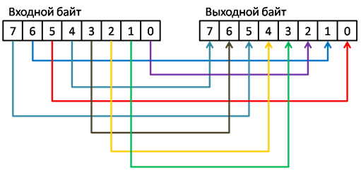
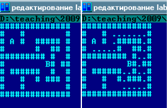
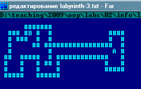
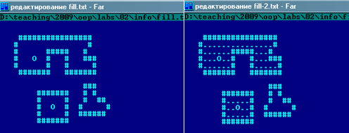

# Лабораторная работа №1. Работа с внешними файлами, использование массивов и операций манипулирования битами.

- [Лабораторная работа №1. Работа с внешними файлами, использование массивов и операций манипулирования битами.](#лабораторная-работа-1-работа-с-внешними-файлами-использование-массивов-и-операций-манипулирования-битами)
  - [Практические задания](#практические-задания)
  - [Обязательные задания](#обязательные-задания)
    - [Задание 1](#задание-1)
      - [Вариант №1 – copyfile – 20 баллов](#вариант-1--copyfile--20-баллов)
      - [Вариант №2 – compare – 40 баллов](#вариант-2--compare--40-баллов)
      - [Вариант №3 – findtext – 50 баллов ](#вариант-3--findtext--50-баллов-)
      - [Вариант №4 – replace – 80 баллов ](#вариант-4--replace--80-баллов-)
      - [Вариант №5 – join – 50 баллов ](#вариант-5--join--50-баллов-)
      - [Вариант №6 – extract – 50 баллов ](#вариант-6--extract--50-баллов-)
    - [Задание 2](#задание-2)
      - [Вариант №1 – calcbits – 20 баллов ](#вариант-1--calcbits--20-баллов-)
      - [Вариант №2 – rotatebyte – 30 баллов ](#вариант-2--rotatebyte--30-баллов-)
      - [Вариант №3 – bin2dec – 30 баллов ](#вариант-3--bin2dec--30-баллов-)
      - [Вариант №4 – dec2bin – 30 баллов ](#вариант-4--dec2bin--30-баллов-)
      - [Вариант №5 – flipbyte – 50 баллов ](#вариант-5--flipbyte--50-баллов-)
      - [Вариант №6 – radix – 100 баллов ](#вариант-6--radix--100-баллов-)
      - [Вариант 7 - magic\_numbers - 50 баллов](#вариант-7---magic_numbers---50-баллов)
        - [Бонус в 10 баллов за возможность поиска магических чисел](#бонус-в-10-баллов-за-возможность-поиска-магических-чисел)
      - [Вариант 8 - same\_week\_day - 50 баллов](#вариант-8---same_week_day---50-баллов)
    - [Задание 3](#задание-3)
      - [Вариант №1 – multmatrix – 40 баллов ](#вариант-1--multmatrix--40-баллов-)
      - [Вариант №2 – invert – 80 баллов ](#вариант-2--invert--80-баллов-)
  - [Дополнительные задания](#дополнительные-задания)
    - [Задание 4](#задание-4)
      - [Вариант №1 – rle – 100 баллов ](#вариант-1--rle--100-баллов-)
      - [Вариант №2 – bmpinfo – 60 баллов ](#вариант-2--bmpinfo--60-баллов-)
      - [Вариант №3 – crypt – 120 баллов ](#вариант-3--crypt--120-баллов-)
    - [Задание 5](#задание-5)
      - [Вариант №1 – live – 150 баллов ](#вариант-1--live--150-баллов-)
      - [Вариант №2 – labyrinth – 180 баллов ](#вариант-2--labyrinth--180-баллов-)
      - [Вариант №3 – fill – 180 баллов ](#вариант-3--fill--180-баллов-)

## Практические задания

- На оценку «**удовлетворительно**» необходимо выполнить часть **обязательных заданий** и набрать не менее 60 баллов
- На оценку «**хорошо**» необходимо выполнить **часть обязательных заданий** и часть дополнительных и набрать не менее 250 баллов
- На оценку «**отлично**» необходимо выполнить все обязательные задания и часть дополнительных и набрать не менее 500 баллов

Внимание, дополнительные задания принимаются только **после успешной защиты** обязательных заданий.

## Обязательные задания

### Задание 1

Выполните задание одного из предложенных вариантов.

#### Вариант №1 – copyfile – 20 баллов

Разработайте программу **copyfile.exe**, выполняющую копирование одного **текстового** файла в другой. Параметры командной строки:

```sh
copyfile.exe <input file name> <output file name>
```

Программа должна корректно обрабатывать ошибки, связанные с файловыми операциями, а также корректно закрывать файлы, когда они больше не нужны.

В комплекте с программой должны обязательно поставляться файлы, позволяющие проверить ее работу в автоматическом режиме.

#### Вариант №2 – compare – 40 баллов

Разработайте программу **compare.exe**, выполняющую сравнение содержимого **текстовых** файлов. Формат командной строки:

```sh
compare.exe <file1> <file2>
```

В том случае, если файлы имеют одинаковое содержимое, программа должна вернуть нулевой результат в операционную систему и вывести строку «Files are equal» в стандартный поток вывода. В противном случае программа должна вывести номер первой строки, в которой были найдены расхождения в содержимом файлов: «Files are different. Line number is <номер строки>», и вернуть значение 1.

Программа должна корректно обрабатывать ошибки, связанные с файловыми операциями.

В комплекте с программой должны обязательно поставляться файлы, позволяющие проверить корректность её работы в автоматическом режиме.

#### Вариант №3 – findtext – 50 баллов <a name="findtext"></a>

Разработайте программу **findtext.exe**, выполняющую поиск указанной строки в файле. Формат командной строки:

```sh
findtext.exe <file name> <text to search>
```

Например:

```sh
findtext.exe "Евгений Онегин.txt" "Я к Вам пишу"
```

В случае, когда искомая строка в файле найдена, приложение возвращает **нулевое** значение и выводит в стандартный выводной поток номера всех строк (по одному номеру в каждой строке), содержащих искомую строку. В противном случае программа возвращает 1 и выводит в стандартный поток вывода «Text not found».

При осуществлении поиска регистр символов имеет значение (это упрощает поиск). Слова «**Онегин**» и «**онегин**» являются разными.

Программа должна корректно обрабатывать ошибки, связанные с файловыми операциями.

В комплекте с программой должны обязательно поставляться файлы, позволяющие проверить корректность её работы в автоматическом режиме.

#### Вариант №4 – replace – 80 баллов <a name="replace"></a>

Разработайте программу **replace.exe**, выполняющую замену всех вхождений подстроки в текстовом файле на другую строку, и записывающей результат в выходной файл (отличный от входного). Формат командной строки:

```sh
replace.exe <input file> <output file> <search string> <replace string>
```

Программа должна корректно обрабатывать ошибки, связанные с открытием входных и выходных файлов.

Размеры входных и выходных файлов таковы, что в оперативную память программы могут не поместиться целиком. Программа должна обрабатывать входной файл построчно и записывать результаты в выходной файл также построчно. Размеры искомой строки и строки-заменителя не ограничены (но с большой вероятностью в ОЗУ поместятся).

Внимание, **программа корректно должна обрабатывать ситуацию, когда длина искомой строки равна нулю**. В этом случае замены символов производиться не должно. Также корректно должна обрабатываться ситуация с многократным вхождением искомой строки в строку-заменитель (например, замена строки «ма» на «мама» не должна приводить к зацикливанию).

В комплекте с программой должны обязательно поставляться файлы, позволяющие проверить ее работу в автоматическом режиме:

- .bat файл, выполняющий запуск программы с различными тестовыми параметрами. Необходимо проверить возможные граничные условия программы, включая недопустимые ситуации.
- Эталонные входные и выходные файлы для проверки работы программы с тестовыми входными данными.

<span style="color:red">**Внимание**: из опыта автора сдаваемые студентами работы часто некорректно обрабатывают ситуацию с возвратом при неудачном поиске. Из-за этого не работает замена подстроки «1231234» внутри текста «12312312345». **Добавьте обработку данной ситуации в набор тестов и убедитесь в корректности работы программы.**</span>

#### Вариант №5 – join – 50 баллов <a name="join"></a>

Разработайте программу **join.exe**, выполняющую слияние содержимого нескольких входных **бинарных файлов** в выходной файл (отличный от входных). Формат командной строки:

```sh
join.exe <input file1> ... <input file N> <output file>
```

Программа должна корректно обрабатывать ошибки, связанные с открытием входных и выходных файлов. Размеры входных и выходных файлов таковы, что в оперативную память программы могут не поместиться целиком.

В комплекте с программой должны обязательно поставляться файлы, позволяющие проверить ее работу в автоматическом режиме. 

#### Вариант №6 – extract – 50 баллов <a name="extract"></a>

Разработать приложение **extract.exe**, выполняющее извлечение фрагмента произвольной длины входного **бинарного** файла начиная с  произвольной позиции в выходной файл. Формат командной строки:

```sh
extract.exe <input file> <output file> <start position> <fragment size>
```

Программа должна корректно обрабатывать ошибки, связанные с открытием входных и выходных файлов, а также корректностью параметров start position и fragment size. В частности, выход за пределы исходного файла является недопустимым.

Размеры входных и выходных файлов таковы, что в оперативную память программы могут не поместиться целиком.

В комплекте с программой должны обязательно поставляться файлы, позволяющие проверить ее работу в автоматическом режиме.

### Задание 2

Выполните задание одного из предложенных вариантов

#### Вариант №1 – calcbits – 20 баллов <a name="calcbits"></a>

Разработайте приложение **calcbits.exe**, выполняющее подсчет и вывод в output количества единичных битов в байте. Для подсчета единичных битов используйте **операции манипулирования битами**.  Формат командной строки:

```sh
calcbits.exe <byte>
```

где **byte** – число в десятичное системе, в двоичном представлении которого должен производиться подсчет установленных в единицу бит.

Например, вызов

```sh
calcbits.exe 5
```

должен выводить в output значение 2 (число 5 в двоичной системе равно 00000101).

В случае некорректных входных данных программа должна выводить пользователю сообщение об ошибке и возвращать ненулевое значение.

В комплекте с программой должны обязательно поставляться файлы, позволяющие проверить ее работу в автоматическом режиме.

#### Вариант №2 – rotatebyte – 30 баллов <a name="rotatebyte"></a>

Разработайте приложение **rotatebyte.exe**, выполняющее **циклическое вращение** битов в байте влево или вправо на заданное количество разрядов. Для решения задачи используйте операции манипулирования битами. Формат командной строки:

```sh
rotatebyte.exe <byte> <number of bits> <L / R>
```

На следующей диаграмме показан пример циклического сдвига некоторого байта на 2 разряда влево.


Например, в результате вызова

```sh
rotatebyte.exe 17 2 L
```

в стандартный поток вывода программа должна вывести **68**

В случае некорректных входных данных (например, если вместо числа программе было передано что-то другое) программа должна выводить пользователю сообщение об ошибке и возвращать ненулевое значение.

В комплекте с программой должны обязательно поставляться файлы, позволяющие проверить ее работу в автоматическом режиме.

#### Вариант №3 – bin2dec – 30 баллов <a name="bin2dec"></a>

Разработайте программу **bin2dec.exe**, выполняющую перевод числа из двоичной системы в десятичную и вывод результата в стандартный поток вывода. Формат командной строки:

```sh
bin2dec.exe <число в двоичной системе>
```

Входной параметр задается в виде целого числа без знака, заданного в двоичной системе в диапазоне от 0 до $2^{32} - 1$

Например, в результате вызова

```sh
bin2dec.exe 110010000
```

в стандартный поток вывода должно быть выведено число 400.

Для перевода числа из двоичной системы в десятичную систему используйте арифметические операции и операции манипулирования битами.

В том случае, когда в качестве входного параметра указано некорректное двоичное число, программа должна вывести соответствующее сообщение об ошибке.

В комплекте с программой должны обязательно поставляться файлы, позволяющие проверить ее работу в автоматическом режиме.

#### Вариант №4 – dec2bin – 30 баллов <a name="dec2bin"></a>

Разработайте программу **dec2bin.exe**, выполняющую перевод числа из десятичной системы в двоичную и вывод результата в стандартный поток вывода. Формат командной строки:

```sh
bin2dec.exe <число в десятичной системе>
```

Входной параметр задается в виде целого числа без знака , заданного в двоичной системе в диапазоне от 0 до $2^{32} - 1$. Выводимое число в двоичной не должно содержать незначащих нулевых бит.

Например, в результате вызова

```sh
bin2dec.exe 253
```

в стандартный поток вывода должно быть выведено число **11111101**.

Для перевода числа из десятичной системы в двоичную систему используйте арифметические операции и операции манипулирования битами.

В том случае, когда в качестве входного параметра указано некорректное десятичное число, программа должна вывести соответствующее сообщение об ошибке.

В комплекте с программой должны обязательно поставляться файлы, позволяющие проверить ее работу в автоматическом режиме.

#### Вариант №5 – flipbyte – 50 баллов <a name="flipbyte"></a>

Разработайте приложение **flipbyte.exe**, выполняющее изменение порядка следования двоичных битов в 8-битовом целом числе (байте), заданном в десятичном представлении, на противоположный. Для этого используйте операторы для работы с битами. «Перевернутый» байт выводится в output также в десятичном представлении с завершающим символом перевода строки \n. Формат командной строки приложения:

```sh
flipbyte.exe <входной байт>
```

Например, в результате вызова

```sh
flipbyte.exe 6
```

в output должно быть выведено 96 ($6_{10}$ = $00000110_2$, после изменения порядка битов данное число превратится в $01100000_2$ = $96_{10}$)

Некорректные входные данные (например, передача строки, не являющейся десятичным числом, или числа, выходящего за пределы 0-255) должно выводиться соответствующе сообщение об ошибке.

В комплекте с программой должны обязательно поставляться файлы, позволяющие проверить ее работу в автоматическом режиме.

#### Вариант №6 – radix – 100 баллов <a name="radix"></a>

Разработайте программу **radix.exe**, выполняющую перевод чисел из одной произвольной системы счисления в другую произвольную и запись результата в стандартный поток вывода. Под произвольной системой счисления понимается система с основанием от 2 до 36. Системы счисления с 11-ричной до 36-ричной должны использовать **заглавные** буквы латинского алфавита от A до Z для представления разрядов с $10_{10}$ до $35_{10}$. Формат командной строки приложения:

```sh
radix.exe <source notation> <destination notation> <value>
```

Например, следующим способом программа должна осуществлять перевод шестнадцатеричного числа 1F в его десятичное представление:

```sh
radix.exe 16 10 1F
```

В конце строки, выводимой в стандартный поток вывода **должен располагаться код \n**.

Программа должна быть способна осуществлять перевод **как положительных, так и отрицательных чисел**, а также нуля. Особое внимание уделите переводу максимальных и минимальных целых чисел на данной платформе (они должны преобразовываться корректно).

Программа должна корректно обрабатывать ошибки 

Внимание, для перевода строкового представления в числовое и числового в строковое в произвольных системах счисления должны быть разработаны функции:

```c++
int StringToInt(const string& str, int radix, bool & wasError);
```

и

```c++
std::string IntToString(int n, int radix, bool & wasError);
```

В случае ошибок (некорректные значения входных параметров, переполнение при переводе строки в число) данные функции **должны изменять состояние булевой переменной wasError**.

В случае обнаружения ошибки программа должна вывести соответствующее сообщение и корректно завершить свою работу.

В комплекте с программой должны обязательно поставляться файлы, позволяющие проверить ее работу в автоматическом режиме.

#### Вариант 7 - magic_numbers - 50 баллов

Неотрицательное число является магическим, если для него выполняется условие: "Разность этого числа и суммы его десятичных цифр **не кратна** 9". Напишите программу, которая определяет, является ли введённое пользователем число магическим.

Программе в stdin поступает 64-разрядное целое беззнаковое число типа `uint64_t`.

Программа должна вывести в stdout:

- Строку "Magic", если введённое число - магическое.
- Строку "Non-magic", если введённое число - не магическое.
- Строку "Error", если на вход программы подали данные, непредставимые в виде числа типа `uint64_t`.

Подсказка: чтобы использовать тип `uint64_t`, подключите файл \<cstdint\>.

В комплекте с программой должны обязательно поставляться файлы, позволяющие проверить ее работу в автоматическом режиме.

##### Бонус в 10 баллов за возможность поиска магических чисел

Бонус начисляется, если программа при запуске с параметром командной строки `-find N` найдёт и выведет все магические числа в диапазоне от 1 до N включительно по одному в каждой строке. Гарантируется, что число N помещается в тип uint64_t.

При запуске без параметров программа должна работать в интерактивном режиме (базовая часть задания).

#### Вариант 8 - same_week_day - 50 баллов

Напишите программу, которая определяет, одинаковый ли день недели у двух дат **одного и того же года**, которые ввёл пользователь. На вход программы в стандартные поток ввода подаются две даты в формате `год месяц число`, под одной в каждой строке. Программа должна вывести `Same week day`, если у этих дат один и тот же день недели, и `Different week days` в противном случае. Если пользователь ввёл невалидную дату или если год у дат различается, программа должна вывести `ERROR`.

Программа должна корректно работать с датами с 1900 по 9999 год.

При решении задачи не разрешается использовать встроенные функции для работы с временем и датой.

**Примеры ввода-вывода**

Пользователь ввёл:

```txt
2024 2 7
2024 3 6
```

Ожидаемый вывод:

```txt
Same week day
```

7 февраля и 6 марта 2024 года — один и тот же день недели (среда).

---

Пользователь ввёл:

```txt
2023 2 7
2023 3 6
```

Ожидаемый вывод:

```txt
Different week days
```

7 февраля и 6 марта 2023 года — разные дни недели.

---

Пользователь ввёл:

```txt
2023 1 1
2024 1 1
```

Ожидаемый вывод:

```txt
ERROR
```

Год у введённых дат различается.

Подсказки:

- У двух дат день недели одинаковый, если количество дней между ними кратно 7.
- Когда обе даты происходят в один год, решение задачи упрощается по сравнению с общим случаем.

### Задание 3

Выполните задание одного из предложенных вариантов

#### Вариант №1 – multmatrix – 40 баллов <a name="multimatrix"></a>

Разработайте приложение **multmatrix.exe**, выполняющее перемножение двух матриц размером 3*3, коэффициенты которых заданы во входных файлах (смотрите **matrix.txt** в качестве иллюстрации), и выводящее результат умножения в стандартный поток вывода. Формат командной строки приложения:

```sh
multmatrix.exe <matrix file1> <matrix file2>
```

Коэффициенты матриц задаются в текстовых файлах в трех строках по 3 элемента.

Коэффициенты результирующей матрицы выводятся **с точностью до 3 знаков после запятой**.

Используйте двухмерные массивы для хранения коэффициентов матриц.

В комплекте с программой должны обязательно поставляться файлы, позволяющие проверить ее работу в автоматическом режиме.

#### Вариант №2 – invert – 80 баллов <a name="invert"></a>

Разработайте приложение invert.exe, выполняющее инвертирование матрицы 3*3, т.е. нахождение обратной матрицы  и выводящее коэффициенты результирующей матрицы в стандартный поток вывода. Формат командной строки приложения:

```sh
invert.exe <matrix file1>
```

Коэффициенты входной матрицы заданы во входном текстовом файле (смотрите файл **matrix.txt** в качестве иллюстрации)  в трех строках по 3 элемента.

Коэффициенты результирующей матрицы выводятся **с точностью до 3 знаков после запятой**.

Используйте двухмерные массивы для хранения коэффициентов матриц.

В комплекте с программой должны обязательно поставляться файлы, позволяющие проверить ее работу в автоматическом режиме.

## Дополнительные задания

### Задание 4

Выполните задания одного из предложенных вариантов.
#### Вариант №1 – rle – 100 баллов <a name="rle"></a>

Разработайте приложение **rle.exe**, выполняющее RLE-компрессию бинарных файлов с сильно разреженным содержимым, а также декомпрессию упакованных ею файлов. Необходимо реализовать следующий принцип компрессии файла:

При обнаружении последовательности одинаковых байтов, она кодируется при помощи двух байтов. Первый байт хранит количество повторов следующего за ним байтов. Например, последовательность байт AAABBBBC, будет представлена в виде следующей **последовательности байт**:

`3, 'A', 4, 'B', 1, 'C'`

Таким образом, исходная 8-байтовая последовательность будет представлена при помощи всего шести байт.

Входные файлы нулевой длины представляются в виде выходных файлов нулевой длины.

Очевидно, что последовательность одинаковых байтов длиной более 255 байт двумя байтами закодирована быть не может, в этом случае первые 2 байта кодируют первые 255 байт последовательности, а затем обрабатываются следующие байты последовательности. Также очевидно, что однобайтовые последовательности требуют в 2 раза больше данных. Тем не менее, в качестве учебного задания для ознакомления с функциями файлового ввода-вывода задание вполне подходит.

Формат параметров командной строки.

Упаковка:

```sh
rle.exe pack <input file> <output file>
```

Распаковка:

```sh
rle.exe unpack <input file> <output file>
```

Программа должна корректно обрабатывать ошибки, связанные с открытием входных и выходных файлов.

Размеры входных и выходных файлов таковы, что в оперативную память программы могут не поместиться целиком.

**В комплекте с программой должен обязательно поставляться .bat файл**, позволяющий проверить работу программы в автоматическом режиме, а также эталонные значения входных и выходных файлов. Проверка должна проверять как корректность работы в режиме упаковки, так и в режиме распаковки. Особое внимание следует уделить проверке работы граничных условий работы программы:

- Входной файл нулевой длины
- Тестирование файлов, содержащих последовательности одинаковых символов в 255, 256 и 257 байт
- Недопустимые ситуации: нечетная длина запакованного файла, количество повторений символа, равное нулю
- Файл, содержащий символы с кодом 255 

#### Вариант №2 – bmpinfo – 60 баллов <a name="bmpinfo"></a>

Разработайте приложение **bmpinfo.exe**, выполняющее считывание заголовка входного файла и, если, судя по заголовку, формат файла соответствует признакам формата BMP (информацию о структуре BMP файла можно найти в Интернет), то необходимо вывести в output следующую информацию:

- Разрешение (ширина и высота файла)
- Количество бит на пиксель
- В случае, если в BMP файле используется палитра (8 и менее бит), необходимо вывести количество используемых цветов.
- Размер изображения в байтах (количество байт, которые занимают данные изображения без учёта размера информационных заголовков BMP)
Если входной файл не является файлом формата BMP, то вывести об этом соответствующее сообщение.

Формат командной строки:

```sh
bmpinfo.exe <input file name>
```

Программа должна корректно обрабатывать ошибки, связанные с файловыми операциями.

Размеры входных и выходных файлов таковы, что в оперативную память программы могут не поместиться целиком.

В комплекте с программой должны обязательно поставляться файлы, позволяющие проверить ее работу в автоматическом режиме. 

**Примечание**: BMP-файлы (редко) могут использовать PNG, RLE или Jpeg-компрессию данных – в этом случае нужно вывести соответствующую информацию

#### Вариант №3 – crypt – 120 баллов <a name="crypt"></a>

Разработайте приложение **crypt.exe**, выполняющее шифрование/дешифрование содержимого входного бинарного файла, и записывающего результат в выходной файл. Формат командной строки:
для шифрования:

```sh
crypt.exe crypt <input file> <output file> <key> 
```

для дешифрования:

```sh
crypt.exe decrypt <input file> <output file> <key> 
```

Параметр key – целое число от 0 до 255, использующееся в алгоритме шифрования и дешифрования.

В качестве алгоритма шифрования должен использоваться следующий алгоритм, осуществляющий последовательно следующие операции с каждым байтом входного файла и записывающий результат в выходной файл:

1. Операция побитового XOR (исключающее ИЛИ, в Си/Си++ осуществляется при помощи оператора ^, например: 3 ^ 2 дает в результате 1, а 1 ^ 2 дает в результате 3) между байтом из файла и параметром key, переданном с командной строки.
2. Перемешивание битов в байте, полученном в результате предыдущей операции по следующей схеме (используйте операции для манипулирования битами):

3. Запись в выходной файл.

Алгоритм дешифрования идентичен алгоритму шифрования с той лишь разницей, что сначала выполняется перемешивание битов в обратном направлении, а затем операция XOR с параметром key, использованном при шифровании. Примечательной особенностью операции XOR является следующее свойство:

```txt
(A XOR B) XOR B = A XOR (B XOR B) = A XOR 0 = A
```

Некорректные входные данные (например, передача в качестве ключа строки, не являющейся десятичным числом, или числа, выходящего за пределы 0-255) должно выводиться соответствующе сообщение об ошибке. То же самое касается обработки ошибок открытия входного и выходного файлов.

Размеры входных и выходных файлов таковы, что в оперативную память программы могут не поместиться целиком.

В комплекте с программой должны обязательно поставляться файлы, позволяющие проверить ее работу в автоматическом режиме.

### Задание 5

Выполните задание одного из предложенных вариантов.
#### Вариант №1 – live – 150 баллов <a name="live"></a>

Разработайте программу **live.exe**, моделирующую одну итерацию (расчет следующего поколения) клеточного автомата игры [Жизнь](https://ru.wikipedia.org/wiki/Игра_«Жизнь»).

Место действия этой игры — «вселенная» — это размеченная на клетки поверхность, безграничная, ограниченная, или замкнутая. **В случае данной лабораторной работы поверхность является ограниченной**. За границами поля клетки считаются пустыми. Каждая клетка на этой поверхности может находиться в двух состояниях: быть живой или быть мёртвой. Клетка имеет восемь соседей. Распределение живых клеток в начале игры называется первым поколением. Каждое следующее поколение рассчитывается на основе предыдущего по таким правилам:

- пустая (мёртвая) клетка рядом с тремя живыми клетками-соседями оживает;
- если у живой клетки есть две или три живые соседки, то эта клетка продолжает жить; в противном случае (если соседок меньше двух или больше трёх) клетка умирает (от «одиночества» или от «перенаселённости»).

Состояние первого поколения задается при помощи содержимого входного текстового файла следующего вида:


Символом `*` задаются границы поля (максимум, 256 * 256), а символом # задается положение живых клеток колонии.

Формат командной строки:

```sh
Life.exe <input file> [<output file>]
```

Если параметр `<ouput file>` не указан, то вывод следующего состояния колонии производится в стандартный поток вывода.

**Внимание** – на решение о том, выживет клетка, погибнет или родится, не должно влиять изменения состояния соседних клеток обработанных перед данной клеткой. Для этого можно использовать два двухмерных массива. Первый - массив с исходным состоянием колонии, заполняемый из входного файла, а второй - массив со следующим состоянием колонии, рассчитывающийся по правилам игры на основе исходного массива и записывающийся в выходной файл (или выводящийся в output).

В комплекте с программой должны обязательно поставляться файлы, позволяющие проверить ее работу в автоматическом режиме.

#### Вариант №2 – labyrinth – 180 баллов <a name="labyrinth"></a>

Разработайте программу **labyrinth.exe**, выполняющую поиск одного из возможных **кратчайших** путей между двумя точками в лабиринте, заданном в текстовом файле. Начальные и конечные точки задаются при помощи символов A и B. Найденный путь изображается при помощи символа «точка».

Лабиринт имеет максимальные размеры до 100*100 клеток и не обязательно должен иметь прямоугольную форму – задача приложения самостоятельно определить границы лабиринта, просканировав входной файл.

Во входном файле могут быть не заданы начальная и конечная точки, либо заданы больше чем 1 раз. При обнаружении такой ситуации приложение должно сообщить пользователю об ошибке.

При отсутствии пути между точками A и B необходимо вывести лабиринт без указания пути.

Формат командой строки:

```sh
labyrinth.exe <input file> <output file>
```  




 

Для поиска кратчайшего пути можно использовать, например, [Волновой Алгоритм](https://ru.wikipedia.org/wiki/Алгоритм_Ли).

В комплекте с программой должны обязательно поставляться файлы, позволяющие проверить ее работу в автоматическом режиме.

**Внимание**: в случае использования рекурсии программа должна умеренно использовать область стека, чтобы ее работа не приводила к переполнению стека (около 1 или 2 мегабайт) ни при каких допустимых входных данных.

#### Вариант №3 – fill – 180 баллов <a name="fill"></a>

Разработать приложение **fill.exe**, выполняющее заливку контуров, заданных в текстовом файле начиная с указанных начальных точек.



Максимальный размер изображения, заданного в текстовом файле – 100*100 точек. При загрузке входных файлов программа может игнорировать элементы за пределами 100 строки или столбца.

Символ 'O' обозначает точки, начиная с которых должна выполняться заливка контуров.

Формат командной строки:

```sh
fill.exe <input file> <output file>
```

В комплекте с программой должны обязательно поставляться файлы, позволяющие проверить ее работу в автоматическом режиме.

**Внимание**: если точка начала заливки находится вне контуров, либо граница контуров содержит разрывы, заливка должна «проливаться» во внешнюю область (но не выходить за пределы 100*100).

**Внимание**: в случае использования рекурсии программа должна умеренно использовать область стека, чтобы ее работа не приводила к переполнению стека (около 1 или 2 мегабайт) ни при каких допустимых входных данных.
